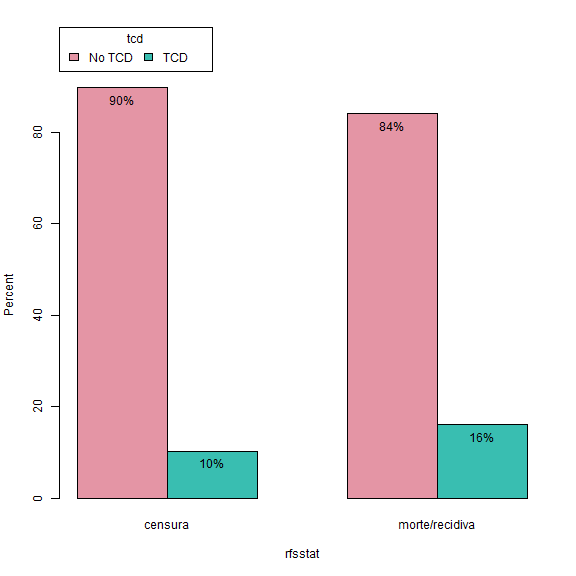
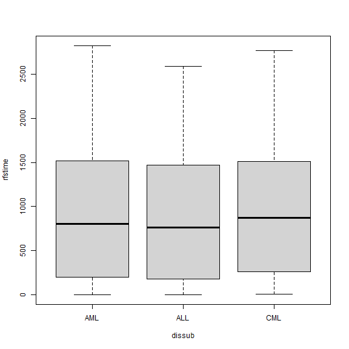
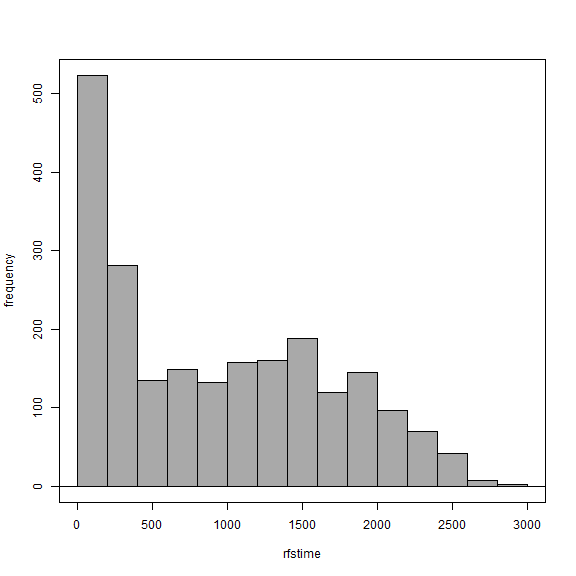

<!-- R Commander Markdown Template -->

Atividade 01 - Análise exploratoria de dados
============================================

### Thalles Cotta Fontainha

### 2023-09-21

#### (Exercício 1):


```r
> load("C:/Users/F193865.STARONE/Downloads/Conjuntos_de_dados (1)/ebmt3.RData")
```


### Frequencies: age, rfsstat

```r
> local({
+   .Table <- with(ebmt3, table(age))
+   cat("\ncounts:\n")
+   print(.Table)
+   cat("\npercentages:\n")
+   print(round(100*.Table/sum(.Table), 2))
+ })
```

```

counts:
age
 <=20 20-40   >40 
  419  1057   728 

percentages:
age
 <=20 20-40   >40 
19.01 47.96 33.03 
```

```r
> local({
+   .Table <- with(ebmt3, table(rfsstat))
+   cat("\ncounts:\n")
+   print(.Table)
+   cat("\npercentages:\n")
+   print(round(100*.Table/sum(.Table), 2))
+ })
```

```

counts:
rfsstat
       censura morte/recidiva 
          1363            841 

percentages:
rfsstat
       censura morte/recidiva 
         61.84          38.16 
```

#### (Exercício 2): O percentual de cada faixa etária da população apresenta é 19.01% com idade <=20, 47.96% com idade entre 20-40 anos e 33.03% com idade >40 anos.


```r
> library(abind, pos=16)
```


### Two-Way Contingency Table: age, rfsstat

```r
> local({
+   .Table <- xtabs(~age+rfsstat, data=ebmt3)
+   cat("\nFrequency table:\n")
+   print(.Table)
+   cat("\nRow percentages:\n")
+   print(rowPercents(.Table))
+ })
```

```

Frequency table:
       rfsstat
age     censura morte/recidiva
  <=20      295            124
  20-40     686            371
  >40       382            346

Row percentages:
       rfsstat
age     censura morte/recidiva Total Count
  <=20     70.4           29.6   100   419
  20-40    64.9           35.1   100  1057
  >40      52.5           47.5   100   728
```

#### (Exercício 3): O percentual de pacientes que sobreviveram em cada faixa etaria e: 29.6% para menor ou igual à 20 anos. Entre 20 e 40 anos sao 64.9% e maiores que 40 anos 52.5%.


```r
> library(e1071, pos=17)
```


### Resumos Numéricos: ebmt3

```r
> numSummary(ebmt3[,c("prtime", "rfstime"), drop=FALSE], groups=ebmt3$age, statistics=c("mean", "sd", "quantiles", 
+   "CV"), quantiles=c(0,.25,.5,.75,1))
```

```

Variable: prtime 
          mean       sd   IQR       0%   25% 50%    75% 100%    n
<=20  389.2912 633.2222 397.5 0.030425 26.00  47 423.50 2578  419
20-40 466.8714 690.9332 708.0 0.030425 26.00  56 734.00 2689 1057
>40   426.0810 649.4042 574.0 4.000000 24.75  50 598.75 2767  728

Variable: rfstime 
          mean       sd     IQR       0%    25% 50%    75% 100%    n
<=20  992.4535 728.4596 1368.50 0.030425 262.50 916 1631.0 2578  419
20-40 959.9716 746.0292 1283.00 0.030425 241.00 865 1524.0 2824 1057
>40   850.8558 720.6033 1268.25 4.000000 172.25 703 1440.5 2812  728
```

#### (Exercício 4): 

#### Em prtime; A média (mean) para idade <= 20 : 389.2912  
#### Em prtime; O desvio padrão (sd) para idade <= 20 : 633.2222  
#### Em prtime; A média (mean) para idade entre 20-40 : 466.8714  
#### Em prtime; O desvio padrão (sd) para idade entre 20-40 : 690.9332  
#### Em prtime; A média (mean) para idade entre > 40 : 426.0810  
#### Em prtime; O desvio padrão (sd) para idade > 40 : 649.4042  
#### e  
#### Em rfstime; A média (mean) para idade <= 20 : 992.4535  
#### Em rfstime; O desvio padrão (sd) para idade <= 20 : 728.4596  
#### Em rfstime; A média (mean) para idade entre 20-40 : 959.9716  
#### Em rfstime; O desvio padrão (sd) para idade entre 20-40 : 746.0292  
#### Em rfstime; A média (mean) para idade entre > 40 : 850.8558  
#### Em rfstime; O desvio padrão (sd) para idade > 40 : 720.6033  


### Bar Plot: rfsstat

```r
> with(ebmt3, Barplot(rfsstat, by=tcd, style="parallel", legend.pos="above", xlab="rfsstat", ylab="Percent", 
+   scale="percent", label.bars=TRUE))
```

<div class="figure">

<p class="caption">plot of chunk unnamed-chunk-8</p>
</div>

#### (Exercicio 5): 
#### No grafico à esqueda entre o grupo "censura": 90% possuem "no TCD", enquanto 10% possuem.  
#### No grafico à direita entre o grupo "morte/recidiva": 84% possuem "no TCD", enquanto 16% possuem.


### Boxplot: rfstime ~ dissub

```r
> Boxplot(rfstime ~ dissub, data=ebmt3, id=list(method="none"))
```

<div class="figure">

<p class="caption">plot of chunk unnamed-chunk-9</p>
</div>

#### (Resposta 6): Os boxplots mostram a subclassificação da doença, no eixo x, é dado por: CML > AML > ALL


### Histogram: rfstime

```r
> with(ebmt3, Hist(rfstime, scale="frequency", breaks="Sturges", col="darkgray"))
```

<div class="figure">

<p class="caption">plot of chunk unnamed-chunk-10</p>
</div>


#### (Exercício 7): 
#### Observado pelo histograma que há uma contagem de frequencias maiores entre 0 e 500 do eixo rfstime.  
#### Sabendo que rfstime é o tempo em dias desde o transplante até a cecidiva ou morte ou ultimo acompanhamento.


